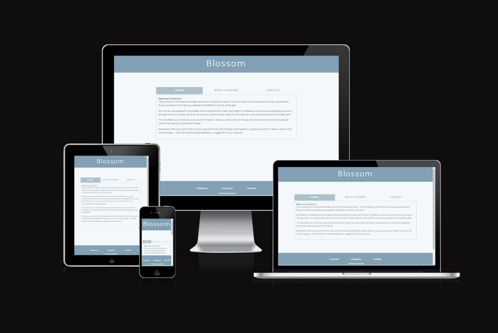
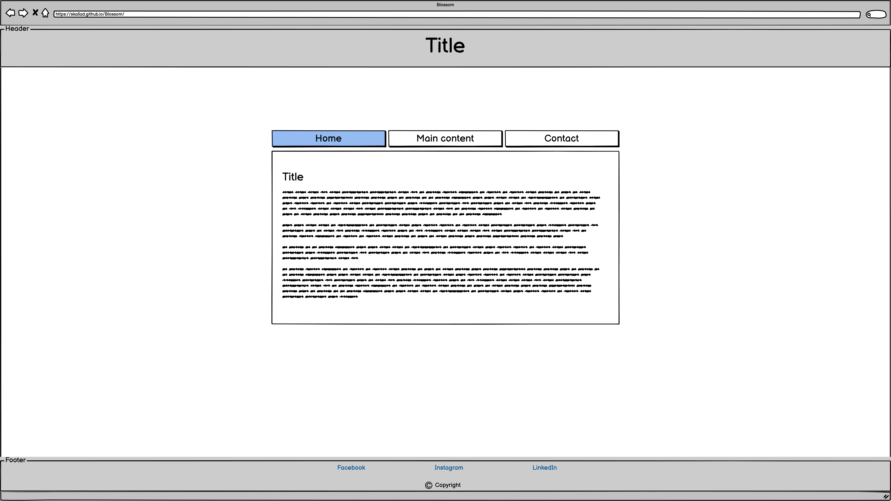
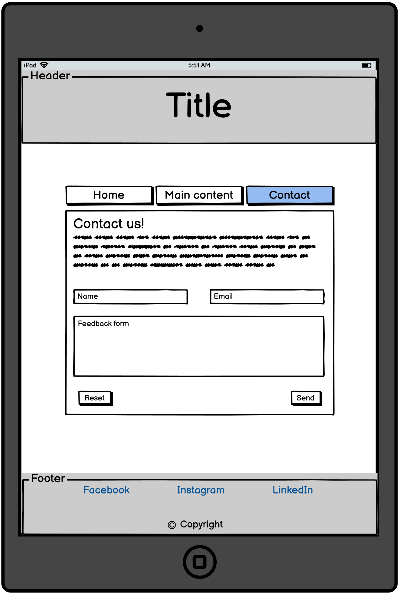

<h1 align="center">
Blossom - Portfolio Project 2 
</h1>  
<h3 align ="center">This website was created from the initial idea of having sketches accompanied by text describing different birth flowers.</h3>
<h3 align="center">The idea derives from the recently found interest of mine in flowers and plants.</h3>  

<h2 align="center">User Experience (UX)</h2>

-   ### User stories

    -   #### As a first time visitor I want to:

        - easily understand the main purpose of the site and learn more about the people behind it.
        - easily navigate through the website to find content.
        - be able to submit feedback if there is anything I want to tell the creator.

    -   #### As a returning visitor I want to:

        - extend my knowledge on birth flowers.
        - be able to submit feedback if needed.
        - access social media links.

    -   #### As a frequent user I want to:
        
        - see if there has been any changes made or content added to the website.
        - be able to contribute with ideas for additional content in the future.

-   ### Design  

    -   #### Colour Scheme and palette
        - The colours picked are *#f4f8fa #eaf2f3 #aec1ca #83a0b4* and *#576772*  
            I chose to a blue monochromatic color scheme where I handpicked the colours based on what I thought suited well together.  
          

    -   #### Typography
        -   The main font throughout the website is Urbanist; used on header, footer and paragraphs as well as the form.  
        Dongle was used for the tabs and headings for the content area of the page. Both fonts use sans-serif as a fallback font. 

-   ### Wireframes 
      
    

<h2 align="center">Features</h2>

-   Responsive on all device sizes

-   Interactive elements:
    - Tabs
    - Months

<h2 align="center">Technologies Used</h2>

### Languages

-   [HTML5](https://en.wikipedia.org/wiki/HTML5)
-   [CSS3](https://en.wikipedia.org/wiki/Cascading_Style_Sheets)
-   [JAVASCRIPT](https://en.wikipedia.org/wiki/JavaScript)

### Frameworks, Libraries & Programs
- [Balsamiq:](https://balsamiq.com/)  
Balsamiq was used to create the wireframes during the design process.
- [Canva](https://www.canva.com/)  
Canva was used to create the colour palette.
- [FormSubmit](https://formsubmit.co/)  
FormSubmit was used to be able to implement feedback from users through sending a copy of the feedback form via email to the site owner. 
- [Google Fonts:](https://fonts.google.com/)  
Google fonts were used to import the 'Urbanist' and 'Dongle' into the HTML and implemented to the site through CSS.
- [Gitpod](https://gitpod.io/)  
Gitpod was used to write the code for the project.
- [GitHub:](https://github.com/)  
GitHub is used to store the project's files and where you can access all associated with it. 
- [Git](https://git-scm.com/)  
Git was used for utilizing the Gitpod terminal to commit to Git and Push to GitHub.   
- [Iconoir](https://iconoir.com/)
    - Iconoir was used to add the copyright icon in the footer.

## Testing

-   W3C html

-   [W3C CSS Validator](https://jigsaw.w3.org/css-validator/#validate_by_input) 

-   [JShint] (https://jshint.com/about/) 

-   Lighthouse testing results : [Lighthouse] 

### Further Testing

-   The Website was tested on Google Chrome and other browsers.
-   The website was viewed on a variety of devices such as Desktop, Laptop, iPhone SE, iPhone 12 Pro & ipad Air.
-   A large amount of testing was done to ensure that all pages were linking correctly.

### Known Bugs

## Deployment

### GitHub Pages

The project was deployed to GitHub Pages using the following steps...

1. Log in to GitHub and locate the [GitHub Repository](https://github.com/Onursoyar/Quote-generator)
2. At the top of the Repository (not top of page), locate the "Settings" Button on the menu.
3. Scroll down the Settings page until you locate the "GitHub Pages" Section.
4. Under "Source", click the dropdown called "main" and select "root".
5. The page will automatically refresh.
6. Scroll back down through the page to locate the now published site [link](https://github.com) in the "GitHub Pages" section.

## Credits

### Code

-   I have taken inspiration for writing the code from a few sources online. My coding style is also inspired from those sources. I have gone through vidoes on youtube and codes on google to have a better understanding. I have also been inspired by  a few sources and hence decided to base my project on those ispirations.
- Major part of my project is based on the Quotes through the API and I have learned and taken API from external sources and the codes given below.

### Content
- [Code to figure out installing an API on a webpage using Javascript](https://dev.to/nehasoni__/random-quote-generator-using-html-css-and-javascript-3gbp)
- [Link for the Quotes API](https://type.fit/api/quotes)
- [Javascript Quote generator Tutorial source 1](https://www.youtube.com/watch?v=r-NkGGxTgZs)
- [Javascript Quote generator Tutorial source 2](https://www.youtube.com/watch?v=NmstSmMykqc)
- [Javascript Quote generator Tutorial source 3](https://www.codeleaks.io/random-quote-generator-using-html-css-and-javascript/)
- [Javascript Quote generator Tutorial source 4](https://www.geeksforgeeks.org/random-quote-generator-using-html-css-and-javascript/)

### Media

-   All the quotes that are generated are from the API.
-   The video on the Home page was created by me usinG Canva and uploaded to youtube to run on home page.

### Acknowledgements

-   My Mentor for his helpful feedback and suggestions.

-   Student support, tutor support and community at Code Institute for their support and problem solving.
- 