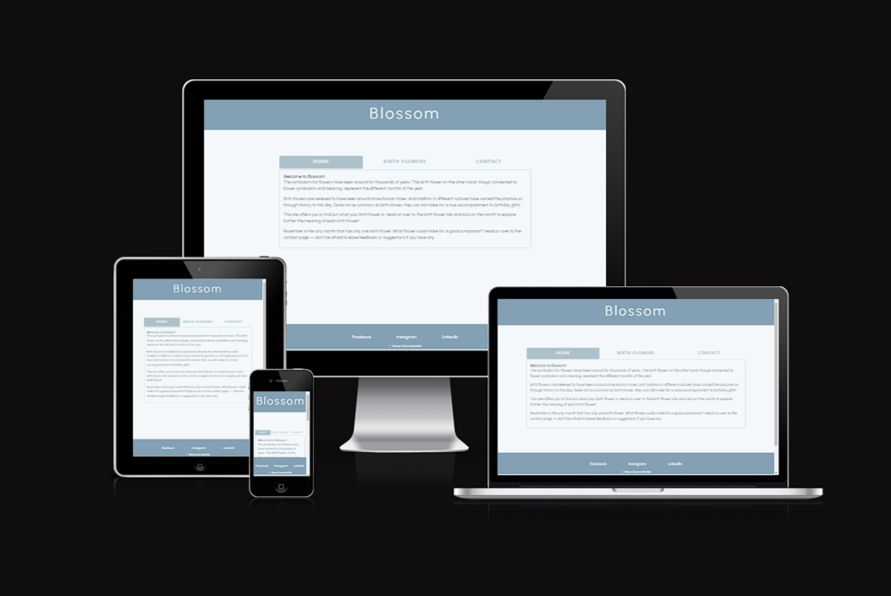
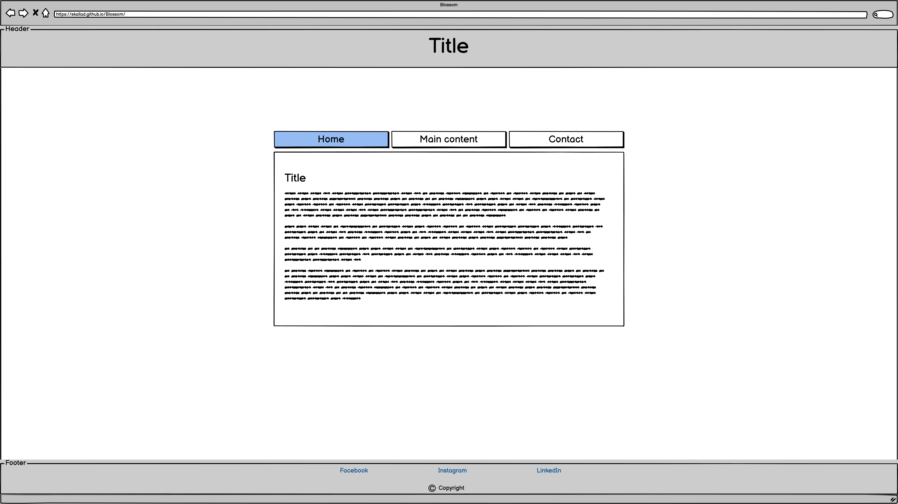
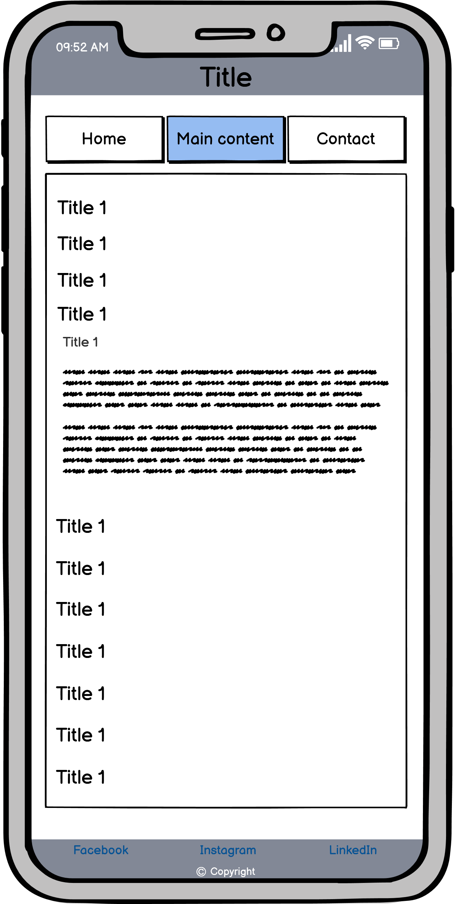
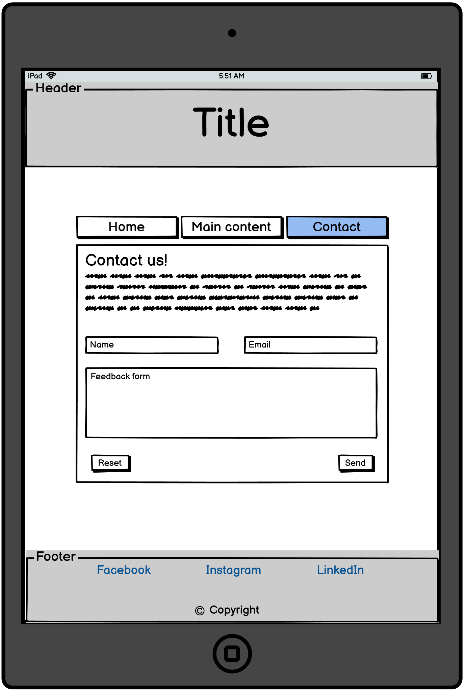
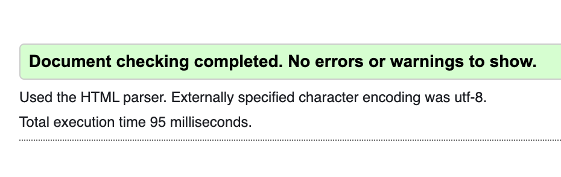
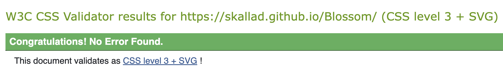
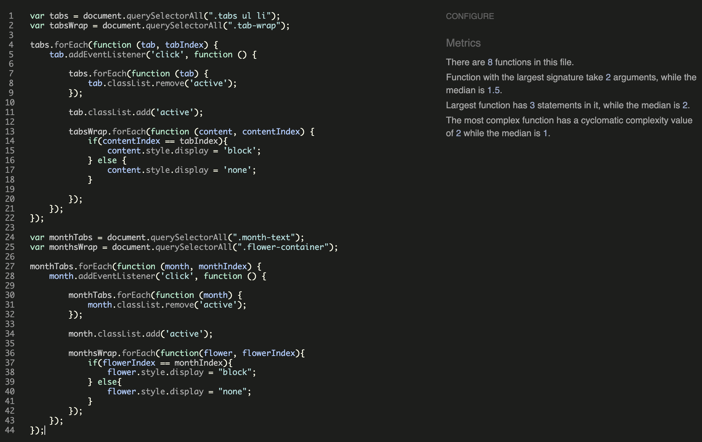
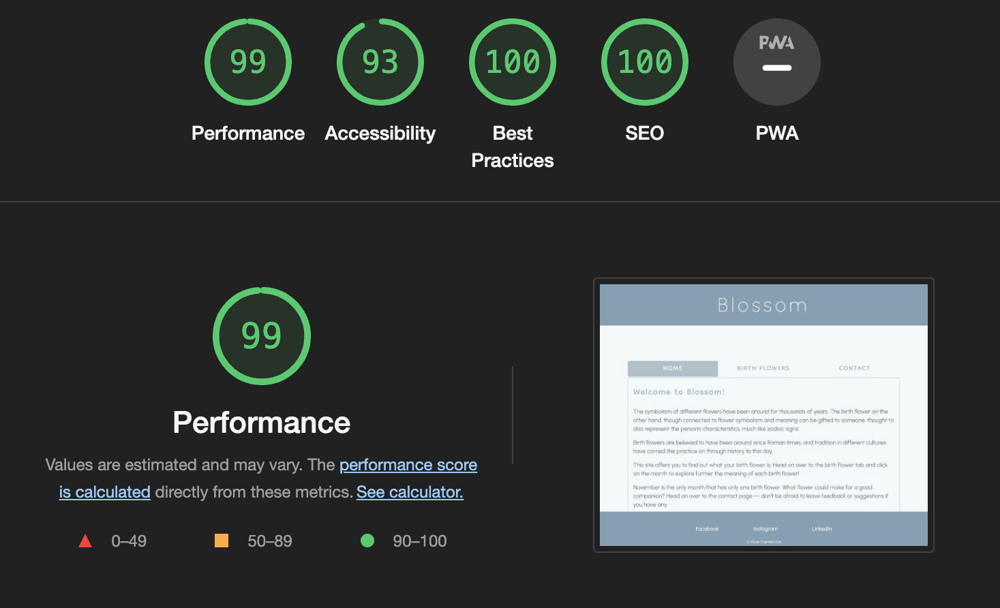

# Blossom - Portfolio Project 2  

This website was created from the initial idea of having sketches accompanied by text describing different birth flowers. The idea derives from the recently found interest of mine in flowers and plants. The sketches intended to accompany the texts were dropped, but might be added in a later stage as I still want to implement more features and make the website more attractive towards users. Additional content in the future is a possibility as well, perhaps including birth stones.  

# User Experience - UX

  ## User stories
  ### As a first time visitor I want to:
   - easily understand the main purpose of the site and learn more about the people behind it.
   - easily navigate through the website to find content.
   - be able to submit feedback if there is anything I want to tell the creator.

  ### As a returning visitor I want to:
   - extend my knowledge on birth flowers.
   - be able to submit feedback if needed.
   - access social media links.

  ### As a frequent user I want to:
   - see if there has been any changes made or content added to the website.
   - be able to contribute with ideas for additional content in the future.

## Design  

### Colour Scheme and palette
   -  The colours picked are *#f4f8fa #eaf2f3 #aec1ca #83a0b4* and *#576772*
   -  I chose to a blue monochromatic color scheme where I handpicked the colours based on what I thought suited well together.  
      

### Typography
   - The main font throughout the website is Urbanist; used on header, footer and paragraphs as well as the form.
   -  Dongle was used for the tabs and headings for the content area of the page. Both fonts use sans-serif as a fallback font. 

### Wireframes 
    
  
    
  
    

## Features
- ### Responsive layout on all device sizes.
- ### Interactive elements:
    - Navigational tabs
    - Months

## Technologies used

### Languages

-   [HTML5](https://en.wikipedia.org/wiki/HTML5)
-   [CSS3](https://en.wikipedia.org/wiki/Cascading_Style_Sheets)
-   [JAVASCRIPT](https://en.wikipedia.org/wiki/JavaScript)

### Frameworks, Libraries & Programs

-  ### [Balsamiq:](https://balsamiq.com/)  
    Balsamiq was used to create the wireframes during the design process.
- ### [Canva](https://www.canva.com/)  
    Canva was used to create the colour palette image included.
- ### [FormSubmit](https://formsubmit.co/)  
    FormSubmit was used to be able to implement recieving feedback from users through sending a copy of the feedback form via email to the the my email. 
- ### [Google Fonts:](https://fonts.google.com/)  
    Google fonts were used to import the 'Urbanist' and 'Dongle' into the HTML and implemented to the site through CSS.
- ### [Gitpod](https://gitpod.io/)  
    Gitpod was used to write the code for the project.
- ### [GitHub:](https://github.com/)  
    GitHub is used to store the project's files and where you can access all associated with it. 
- ### [Git](https://git-scm.com/)  
    Git was used for utilizing the Gitpod terminal to commit to Git and Push to GitHub.   
- ### [Iconoir](https://iconoir.com/)  
    Iconoir was used to add the copyright icon in the footer.

## Testing  

#### HTML and CSS validation:  

  

#### JShint testing:  

####  Lighthouse test:  

### Further Testing

-   The Website was tested on Google Chrome and other browsers.
-   The website was viewed on a variety of devices such as Desktop, Laptop, iPhone SE, iPhone 12 Pro & ipad Air.
-   A large amount of testing was done to ensure that there were no reduntant lines of code, as well as checking for spelling errors and basic HTML and CSS file structure.

### Known Bugs
- No known bugs.

## Deployment

### GitHub Pages

The project was deployed to GitHub Pages following these steps:

1. Log in to GitHub and locate the Settings for your repository. It is in the upper part of the page along with other tools.
2. Locate at the left hand side of the screen the *Pages* tab and access that page.
3. Under **Branch** click the dropdown menu and choose "main"
4. on "Source", click the dropdown and select "root".
5. Save, and the page will automatically refresh (if not, refresh manually).
6. Scroll back up through the page to locate the now published site [link](https://github.com) in the "GitHub Pages" section.

## Credits & Sources

### Code

-   I have taken inspiration and help for writing the code from a few sources, both from YouTube and W3schools to help me understand how the code works and how it can affect the outcome of the website.

### Sources
- [Tutorial for creating tabs](https://www.youtube.com/watch?v=S5pnVu_d3Mw)  
This tutorial greatly helped me implement the end results I wanted and be able to use the same functions but for the months where the flower descriptions are displayed.
- [W3Schools](https://www.w3schools.com/)  
I took help from this website especially to learn more aobut using flexboxes and further extend my knowledge about MediaQueries as it helped me get the layout I wanted and for the website to respond on different screen sizes properly.
- [The Old Farmer's Almanac](https://www.almanac.com/) and [Truly Experiences](https://trulyexperiences.com/blog/birth-month-flowers/)  
These websites were used to collect information on the meanings behind birth flowers as well as history behind birth flowers.

### Media

-   No media used on the website.

### Acknowledgements

-   My mentor for keeping me motivated during the last stretch of this project and helping me worry less about the future!

-   The Student Care Team for offering their support when I needed it the most. It has been a struggle at some points, but with their help, they made this project possible.